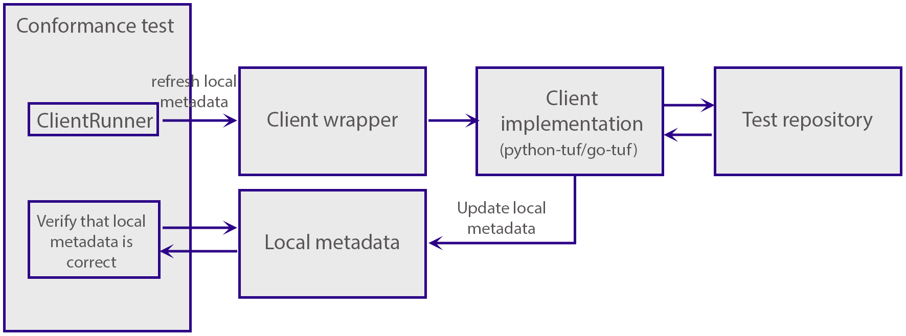

# Client interface

Clients must implement the following command-line interface:

`init`: Initialises the clients local trusted metadata. It has the following command-line arguments:
- `--metadata-dir`, Required: The localpath where the client stores metadata.
- `--trusted-root`, Required: The initial root. The conformance tests generate this.

`refresh`: Updates the local metadata from the repository.
- `--metadata-dir`, Required: The localpath where the client stores metadata.
- `--metadata-url`, Required: The URL to the repository. The test suite takes care of passing the URL to the local repository.

`download`: Downloads a target file.
- `--metadata-dir`, Required: The localpath where the client stores metadata.
- `--metadata-url`, Required: The URL to the repository. The test suite takes care of passing the URL to the local repository.
- `--target-name`: The name of the target from the `targets.json` metadata.
- `--target-base-url`: Base URL to download the target file from. Clients are expected to concatenate `--target-base-url` with `--target-name`.
- `--target-dir`: The directory in which the client stores downloaded files.

## Integrating a client

The conformance tests implements a `ClientRunner` class which represents the client in the conformance test suite. The goal of the `ClientRunner` is to carry out high-level tasks, for example:

1. Update local metadata
2. Download target file
3. Check that the local metadata is what we expect
4. Check that a downloaded target file is the one we expected.

Some of these tasks are mere assertions against the local metadata. Others require `ClientRunner` to interact with the remote repository. When the `ClientRunner` needs to interact with the repository, it does so through a client wrapper. A client wrapper is a layer between the TUF-conformance test suite and a TUF client implementation. The client wrapper's goal is to invoke the client implementation we want to test. Client wrappers are responsible for:

1. receiving the parameters from the conformance test-suite
2. invoking the client implementation in a correct manner with the parameters from the test-suite.

We can illustrate the behavior as such:

In a conformance test, a `ClientRunner` instructs the client wrapper to fetch the latest metadata. The client wrapper invokes the client implementation - for example python-tuf or go-tuf. The client implementation interacts with the test repository; the client implementation also stores the metadata. The conformance test can then interact directly with the local metadata and verify that it is correct. 

## Where should clients run their tests?

The intention is that TUF client implementations that want to use the test suite will include wrappers like this in their source code, and will run the test suite in their CI systems.

This project may then also run the test suite using the wrappers from the TUF implementations, but the intention is that this repository would not have to e.g. maintain dependency lists for the client wrappers.

That said, some wrappers are included for now:
* We will likely tweak the "wrapper API" while we build the initial test suite: while this goes on, it makes
  sense to keep the wrappers here
* We do need something to test the test suite itself
* There is no easy way to run the test suite in a TUF implementation CI yet